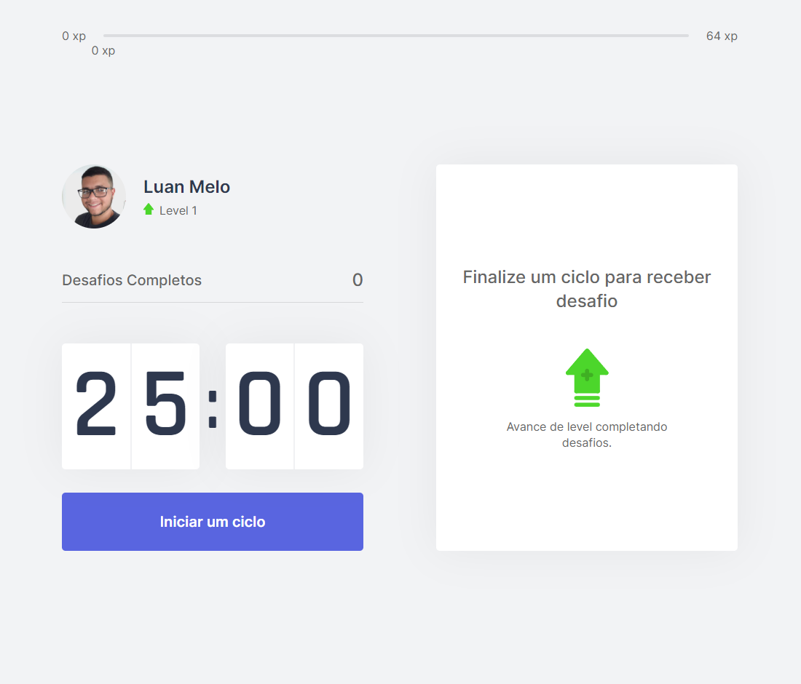
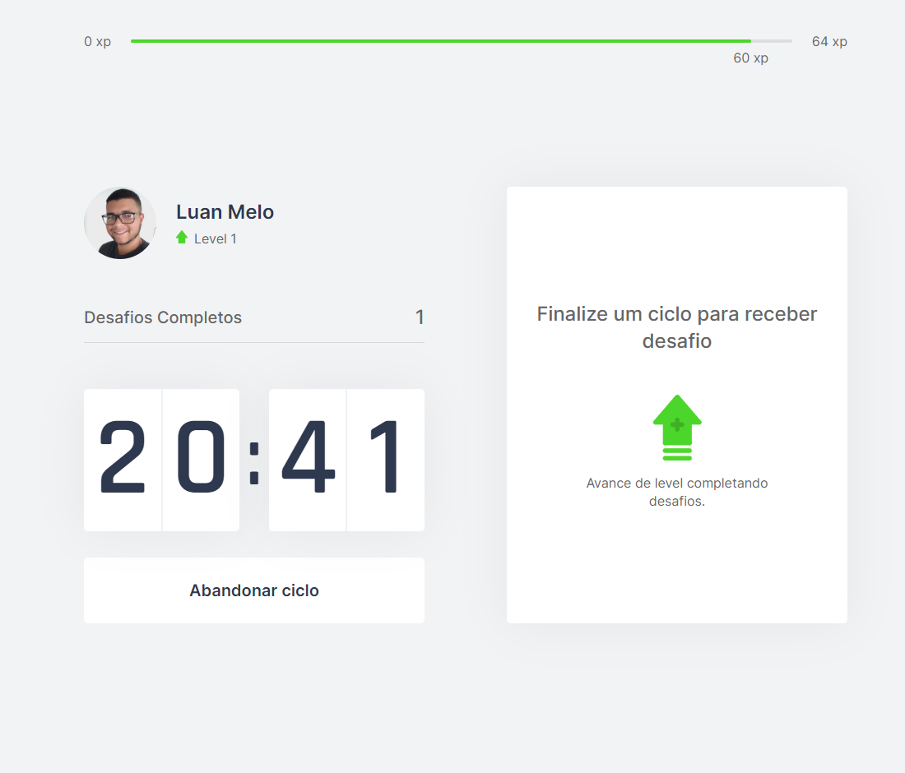
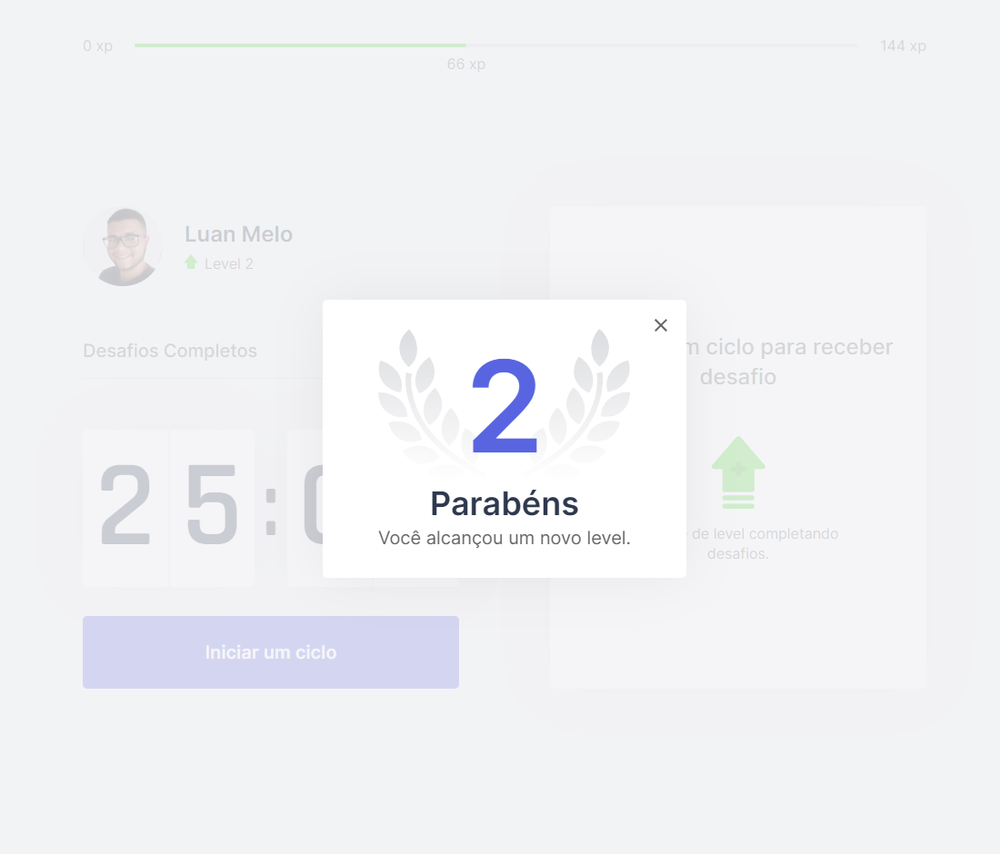

# Move.it | Next Level Week #04

Projeto desenvolvido durante a Next Level Week 4, evento organizado pela [Rocketseat](https://www.rocketseat.com.br/). O Move.it é uma aplicação que usa a técnica de pomodoro de uma forma gamificada para aumentar a produtividade e foco do usuário. 

Acesse a aplicação [aqui](https://moveit-nlw4-zqs3.vercel.app/)

 
 

## :art: Figma
Acesse o layout original [aqui](https://www.figma.com/file/ge20pu3ofMOKoliUyKx1Nl/Move.it-1.0?node-id=160%3A2761)

## :rocket: Tecnologias
* Next.js
* React
* Typescript
* CSS

## :computer: Como executar o projeto

1. Certifique-se de ter o Node.js instalado em sua máquina.
2. Clone este repositório para o seu computador.
3. Na pasta do projeto, abra o terminal e execute o comando `yarn install` para instalar as dependências.
4. Em seguida, execute o comando `yarn dev` para iniciar o servidor de desenvolvimento.
5. O aplicativo será aberto automaticamente no seu navegador. Se não abrir, acesse o endereço especificado no terminal.
